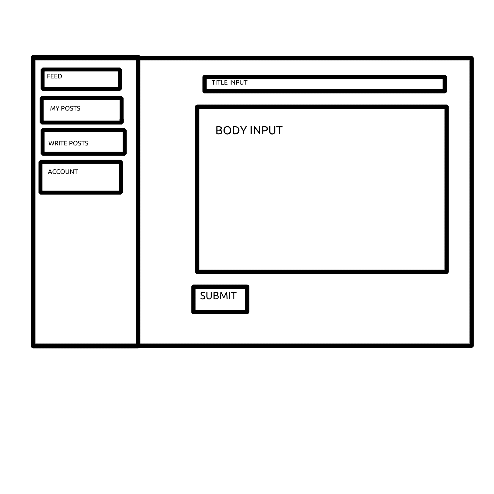

# Tome
  We are proud to showcase this not so new technology.
  In his application you can sign up and in as a user.
  Each user has the ability to post tomes about anything they
  like. Each tome will be owned by the user who created it and can only be
  modified or removed by the owner. Users also, have the ability to
  leaves notes on other tomes as well. A user can only leave a note and see user stats
  only when they have signed up for an account. Users can still read all tomes without an account.
  Users can also save tomes to the Archive where they can go back and read their favorites

  ## Technologies
    This application was created using the following technologies
    * HTML
    * CSS
    * Bootstrap
    * Handlebars
    * JavaScript
    * JQuery
    * AWS
    * Ajax

  ## Goals for V2
  *Give users the ability to comment on a comment to begin a nested discussion
  *Give the owner of a post admin privileges to remove a comment from another
  user should it be deemed inappropriate.

  ## Our Journey
  We began by creating wireframes for the layout of our client side
  application and creating user Stories to brainstorm blog functionality. Once
  we established a solid idea of our functionality we implemented our auth routes.
  We, then, started creating our CRUD functionality over our blog posts,
  implemented comments, and CRUD over our comments. From there we cereated api requests to call different part of the data.
  We styled and finished up our MVP, moving forward we added various features one by one.
  Proiritizing ones that could be completed easily and add the most positive UI experience.

  ## User Stories
  * As a user I would like to be able to create a user account
  * As a user I would like to be able to be able to sign in to my account
  * As a user I would like to be able to change my password once logged in
  * As a user I would ike to be able to create tomes that are owned by my
  account and can only be modified or removed when I am signed in as that user
  * As a user I would like to be able leave notes on tomes created by other
  users
  * As a user I would like to have the ability to modify or remove any notes
  that I leave on a post.
  * As a user I would like to be able to Sign out of my account.

  **Stretch Goal Stories**
  * As a user I want to be able to save others posts to read later
  * As a user I want to be able to like others posts
  * As a user I would like to be abl to upload a profile picture
  * As a user I would like to be able to see all of one users tomes and tome stats

  ## Wireframes

  ### Blog non-user views

  #### Basic view
  

  #### Sign-up view
  

  #### Sign-in view
  

  ### Blog user views

  #### User home view
  

  #### My posts (user's personal posts) view
  

  #### Write post view
  

  #### Change password view
  

  ### Blog Feed view
  
